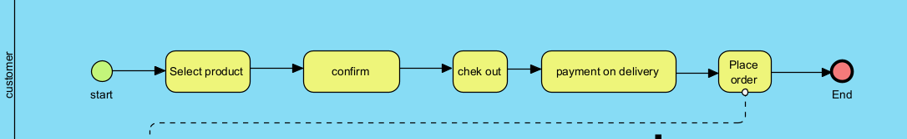
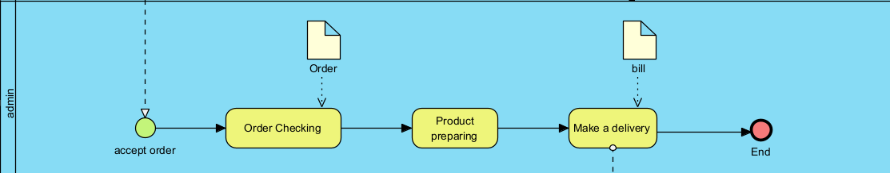
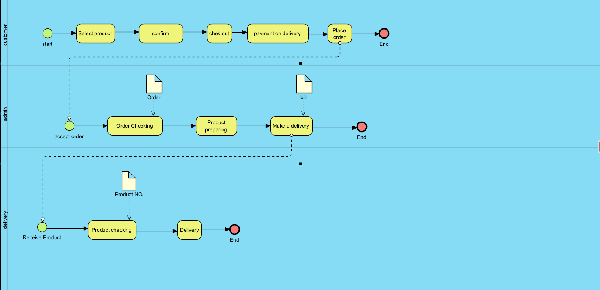

# Modern-Ecommerce-Platforms
Design and Develop Modern Ecommerce Plafform
projent overview

My project is a website khon lang klong is a camera shop. Websites are built using WordPress as a platform that makes it easy for interested customers to purchase through this platform.

My model will have three parts: 
1. Customer
2. System administrator
3. Shipping company

   The first part of the website starts with the customer coming to browse the products on the website and the customer can choose to view and click to order immediately via payment upon delivery. First of all, I would like to inform you that my website or store does not have any instructions regarding the ordering process.

The aforementioned format is the same as in this picture.

And in the second part is the admin part.

The admin's duty is to receive orders, pack products and deliver products to the delivery company.

and in the third part will be a transport company

Delively's duty is to receive products from admin to deliver to customers.

And this is the whole working process of the model. 

Thank you.

