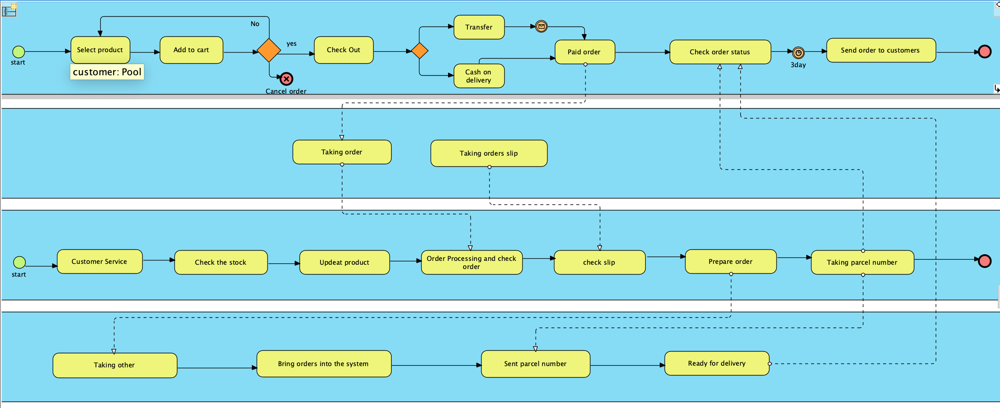
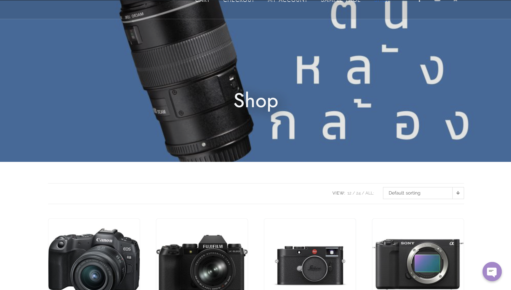
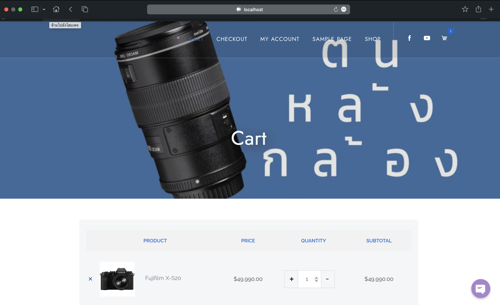
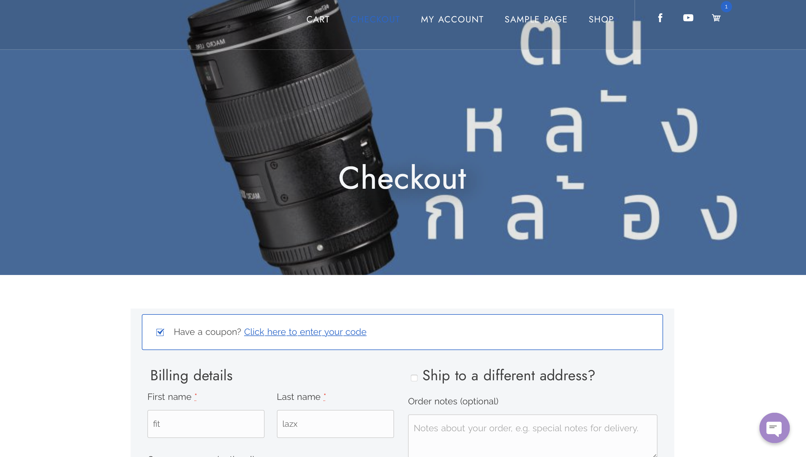

# Modern-Ecommerce-Platforms
Design and Develop Modern Ecommerce Plafform
Name: Natthawut Chaitap 
ID: 631431034

Modern ecommerce platform project
My project is the Khon Lang Klong website. It is a website that sells many brands of cameras to choose from. Our store has cameras. There are many options available to capture your most precious moments using WordPress as a platform that makes it even easier for interested customers to purchase through this platform.
My model will have three parts:

## Content
1. Introduction
2. Software and Tools Used
3. Discussion and Details
4. Conclusion

   ## Introduction
  The world of e-commerce has witnessed a tremendous surge in recent years, with online shopping becoming an integral part of consumers' daily lives. To meet the demands of this ever-growing market, businesses must adapt and innovate their online shopping platforms. This abstract introduces a comprehensive case study on the development and optimization of an e-commerce website using WordPress, one of the most popular and versatile content management systems available. and Key elements and strategies used to create a smooth and easy-to-use online shopping experience. From choosing the right WordPress theme and plugins to designing an intuitive user interface.

  ## Software and Tools Used
  **MAMP:** "mamp (Mac, Apache, MySQL, PHP) is a development environment on your computer that allows you to run a web server. It is commonly used for developing and testing websites and web applications, including e-commerce websites built on WordPress. When using MAMP to create WordPress e-commerce websites."
  
  **WordPress:** WordPress serves as the primary content management system (CMS) for our website, offering a flexible and user-friendly environment for managing web content.
  
  **Visual Paradigm:** "Visual Paradigm" is a software modeling and diagramming tool that serves various purposes, including software development, business process modeling, system architecture design, and more. It provides a graphical user interface that allows users to create, edit, and visualize diagrams and models of different types.
  #### The main plugins that we use are as follows.
  1. WooCommerce: WooCommerce is a popular open-source e-commerce plugin for WordPress, one of the most widely used content management systems (CMS) for creating websites .
  2. PDF Invoices & Packing Slips for WooCommerce
  3. WooCommerce PDF Invoices & Packing Slips Thai Language Pack
  4. PeproDev WooCommerce Receipt Uploader
  5. Chaty: Chaty is a Floating Chat Widget plugin that user can click on link to get more contact with the website

  ## Discussion and Details
  My theme is costume shop.

  ## BPMN Diagram
  
  This is a BPMN diagram showing my ecommerce website process. It shows the various layers and functions of the website.

  ## All Pools in BPMN
- Customer
- Website
- Admin
- Delivery

  ### Customer
  ### Website
  ### Admin
  ### Delivery

  ## Website overview
  
  
  
  
  
  
  

     
     
  
  
  
  

  

   

