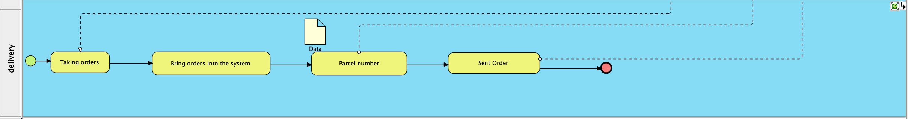

# Modern-Ecommerce-Platforms
Design and Develop Modern Ecommerce Plafform
Name: Natthawut Chaitap 
ID: 631431034

Modern ecommerce platform project
My project is the Khon Lang Klong website. It is a website that sells many brands of cameras to choose from. Our store has cameras. There are many options available to capture your most precious moments using WordPress as a platform that makes it even easier for interested customers to purchase through this platform.

## Content
1. Introduction
2. Software and Tools Used
3. Discussion and Details
4. Conclusion

   ## Introduction
  The world of e-commerce has witnessed a tremendous surge in recent years, with online shopping becoming an integral part of consumers' daily lives. To meet the demands of this ever-growing market, businesses must adapt and innovate their online shopping platforms. This abstract introduces a comprehensive case study on the development and optimization of an e-commerce website using WordPress, one of the most popular and versatile content management systems available. and Key elements and strategies used to create a smooth and easy-to-use online shopping experience. From choosing the right WordPress theme and plugins to designing an intuitive user interface.

  ## Software and Tools Used
  **MAMP:** "mamp (Mac, Apache, MySQL, PHP) is a development environment on your computer that allows you to run a web server. It is commonly used for developing and testing websites and web applications, including e-commerce websites built on WordPress. When using MAMP to create WordPress e-commerce websites."
  
  **WordPress:** WordPress serves as the primary content management system (CMS) for our website, offering a flexible and user-friendly environment for managing web content.
  
  **Visual Paradigm:** "Visual Paradigm" is a software modeling and diagramming tool that serves various purposes, including software development, business process modeling, system architecture design, and more. It provides a graphical user interface that allows users to create, edit, and visualize diagrams and models of different types.
  #### The main plugins that we use are as follows.
  1. WooCommerce: WooCommerce is a popular open-source e-commerce plugin for WordPress, one of the most widely used content management systems (CMS) for creating websites .
  2. PDF Invoices & Packing Slips for WooCommerce
  3. PeproDev WooCommerce Receipt Uploader
  4. Chaty: Chaty is a Floating Chat Widget plugin that user can click on link to get more contact with the website

  ## Discussion and Details
  My theme is costume shop.
 ## Steps to install mamp and WordPress
### Step 1: Install MAMP

Download MAMP from the official website (https://www.mamp.info/).

Open the downloaded installer package and follow the on-screen instructions to install MAMP on your macOS.

### Step 2: Start MAMP

Launch MAMP by searching for it in your Applications folder or using Spotlight.

Start the MAMP application. It will also start the Apache web server and MySQL database server.

Click on the "Open WebStart page" button in the MAMP application. This will open a web browser window with the MAMP dashboard.

### Step 3: Set Up a MySQL Database

In the MAMP dashboard, click on the "phpMyAdmin" link in the Tools section. This will open phpMyAdmin in your browser.

Create a new database for your WordPress installation. Choose a name for your database (e.g., "wordpress") and click the "Create" button.

### Step 4: Download and Install WordPress

Download the latest version of WordPress from the official website (https://wordpress.org/download/).

Extract the downloaded WordPress zip file to a folder in your macOS, such as the "htdocs" folder inside the "MAMP" folder. This is where your local websites will be stored.
### Step 5: Install WordPress

Open your web browser and go to http://localhost:8888/wordpress (or the folder name where you installed WordPress).

You will see the WordPress setup wizard. Select your language and click "Continue."

Enter the site title, username, password, and email address for your WordPress site. Click "Install WordPress."

After installation is complete, you can log in to your WordPress site using the credentials you just created.

### Step 6: Use WordPress

You can now start building your website using WordPress. Access the WordPress admin dashboard by going to http://localhost:8888/wordpress/wp-admin/ and logging in with your username and password.

You can install themes, plugins, and create content just like you would on a live WordPress site.

Remember that this is a local development environment, so your site will only be accessible on your local machine. When you're ready to launch your site online, you'll need to choose a web hosting provider and follow their instructions for migrating your WordPress site.

 ## Website overview
  HomePage
  
  Shop
  
  Cart
  
  Checkout
  

 
  ## BPMN Diagram
  
  This is a BPMN diagram showing my ecommerce website process. It shows the various layers and functions of the website.

  ## All Pools in BPMN
- Customer
- Website
- Admin
- Delivery

  ### Customer
  
  - Start Event (Green Circle): Marks the beginning of the customer's journey on the platform.
  - Customers can choose whether to go talk to the admin first or choose the product.
  - Select Products: The customer selects the desired products from the available options.
  - Put the product in the cart If the customer leaves the site, it is considered final.
And if customers buy again, they will go shopping again with the store page.
  - Next is Check Out and select the payment method and complete the order.
    ### Check product status
    Customer can check product status with percen namber.
    

  
  ### Website
  
  
   As for the website, it acts as a middle ground between Customers and admin
  -
  ### Admin
  
  For admins, there are 4 duties on our website.
  
  1 Add product information
  
  2 Chaty
  
  3 Web Dev
  
  4 Taking order
  
  ### Delivery
  

  ## Conclusion

  
  
  

     
     
  
  
  
  

  

   

